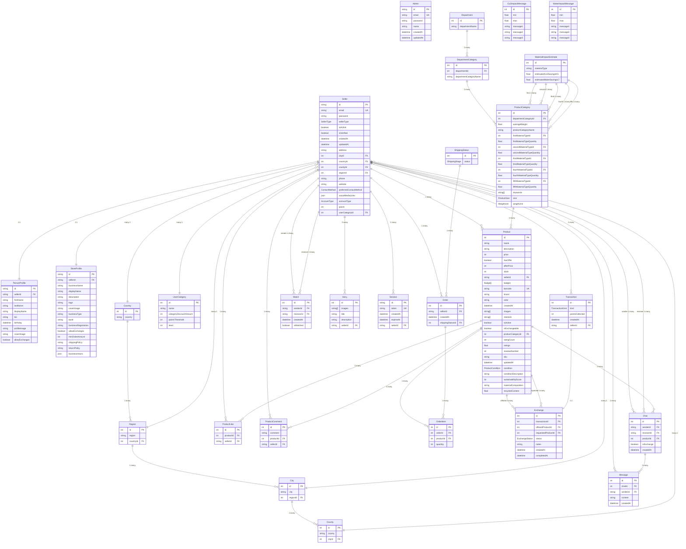

# Database Schema - Technical Relationship Map

## Complete Entity Relationship Diagram with Field Details



## Foreign Key Relationships Detail

### **Seller Table Foreign Keys**

- `cityId` → City.id
- `countryId` → Country.id
- `countyId` → County.id
- `regionId` → Region.id
- `userCategoryId` → UserCategory.id

### **Profile Tables Foreign Keys**

- `PersonProfile.sellerId` → Seller.id (CASCADE DELETE)
- `StoreProfile.sellerId` → Seller.id (CASCADE DELETE)

### **Location Hierarchy Foreign Keys**

- `Region.countryId` → Country.id
- `City.regionId` → Region.id
- `County.cityId` → City.id

### **Product System Foreign Keys**

- `Product.sellerId` → Seller.id
- `Product.productCategoryId` → ProductCategory.id
- `ProductCategory.departmentCategoryId` → DepartmentCategory.id
- `DepartmentCategory.departmentId` → Department.id
- `ProductCategory.[1-5]MaterialTypeId` → MaterialImpactEstimate.id

### **Commerce Foreign Keys**

- `Order.sellerId` → Seller.id (buyer)
- `Order.shippingStatusId` → ShippingStatus.id
- `OrderItem.orderId` → Order.id
- `OrderItem.productId` → Product.id
- `Transaction.sellerId` → Seller.id
- `Exchange.transactionId` → Transaction.id
- `Exchange.offeredProductId` → Product.id
- `Exchange.requestedProductId` → Product.id

### **Communication Foreign Keys**

- `Chat.senderId` → Seller.id
- `Chat.receiverId` → Seller.id
- `Chat.productId` → Product.id (optional)
- `Message.chatId` → Chat.id
- `Message.senderId` → Seller.id

### **Social Foreign Keys**

- `Match.senderId` → Seller.id
- `Match.receiverId` → Seller.id
- `Story.sellerId` → Seller.id

### **Authentication Foreign Keys**

- `Session.sellerId` → Seller.id

### **Interaction Foreign Keys**

- `ProductLike.productId` → Product.id
- `ProductLike.sellerId` → Seller.id
- `ProductComment.productId` → Product.id
- `ProductComment.sellerId` → Seller.id

## Index Strategy Recommendations

### **Primary Indexes** (Already defined)

- All PK fields are automatically indexed
- UK fields (email, token, barcode) are automatically indexed

### **Recommended Additional Indexes**

```sql
-- Performance indexes for common queries
CREATE INDEX idx_seller_type ON Seller(sellerType);
CREATE INDEX idx_seller_location ON Seller(cityId, countryId);
CREATE INDEX idx_product_seller ON Product(sellerId);
CREATE INDEX idx_product_category ON Product(productCategoryId);
CREATE INDEX idx_product_active ON Product(isActive);
CREATE INDEX idx_product_condition ON Product(condition);
CREATE INDEX idx_order_seller ON Order(sellerId);
CREATE INDEX idx_chat_participants ON Chat(senderId, receiverId);
CREATE INDEX idx_message_chat ON Message(chatId);
CREATE INDEX idx_transaction_seller ON Transaction(sellerId);

-- Composite indexes for complex queries
CREATE INDEX idx_product_seller_active ON Product(sellerId, isActive);
CREATE INDEX idx_chat_product ON Chat(productId) WHERE productId IS NOT NULL;
```

This technical schema shows every foreign key relationship and provides a complete picture of how your ecommerce platform data is interconnected!
