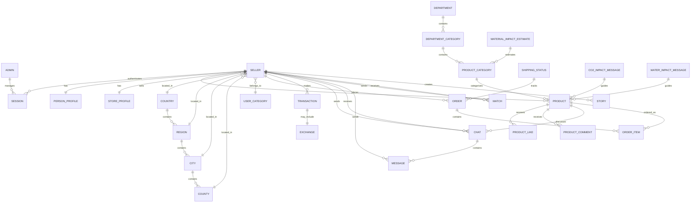

# Ekoru Ecommerce Schema - Entity Relationship Diagram

## Core Entities Overview



## Detailed Relationship Breakdown

### 1. **Seller System (Core)**

```
SELLER (Base Entity)
├── PersonProfile (1:1) - Individual sellers
├── StoreProfile (1:1) - Business sellers
├── Products (1:Many) - What they sell
├── Orders (1:Many) - What they buy
├── Sessions (1:Many) - Authentication
└── UserCategory (Many:1) - Loyalty tier
```

### 2. **Location Hierarchy**

```
COUNTRY
└── REGION
    └── CITY
        └── COUNTY
            └── SELLER (located here)
```

### 3. **Product Catalog Structure**

```
DEPARTMENT
└── DEPARTMENT_CATEGORY
    └── PRODUCT_CATEGORY
        ├── MATERIAL_IMPACT_ESTIMATE (sustainability data)
        └── PRODUCT
            ├── ProductLike (engagement)
            ├── ProductComment (reviews)
            ├── Chat (negotiations)
            └── OrderItem (sales)
```

### 4. **Commerce Flow**

```
SELLER (buyer) → ORDER → ORDER_ITEM → PRODUCT
                    ↓
              SHIPPING_STATUS (tracking)
                    ↓
              TRANSACTION (payment/points)
                    ↓
              EXCHANGE? (if applicable)
```

### 5. **Communication System**

```
SELLER ←→ CHAT ←→ SELLER
    ↓
  MESSAGE
    ↓
 (about PRODUCT?)
```

### 6. **Social Features**

```
SELLER → MATCH → SELLER (connections)
SELLER → STORY (social posts)
```

## Key Relationship Types

### **One-to-One Relationships**

- `Seller ↔ PersonProfile` (exclusive)
- `Seller ↔ StoreProfile` (exclusive)
- `Transaction ↔ Exchange` (optional)

### **One-to-Many Relationships**

- `Seller → Products` (seller can have many products)
- `Seller → Orders` (seller can place many orders)
- `Product → ProductLikes` (product can have many likes)
- `Chat → Messages` (chat can have many messages)

### **Many-to-Many Relationships** (through junction tables)

- `Seller ↔ Seller` (via Match table for connections)
- `Product ↔ Product` (via Exchange table for swaps)

## Business Rules Enforced by Schema

### **Seller Type Constraints**

- **PERSON**: Can sell AND exchange products
- **STORE**: Can only sell products (exchanges disabled)

### **Product Conditions**

- All products have condition tracking (NEW, USED, REFURBISHED, etc.)
- Sustainability metrics (recycled content, impact scores)

### **Exchange System**

- Only persons can initiate exchanges
- Products must be marked as exchangeable
- Exchange creates transaction record

## Table Sizes & Relationships Summary

| Table               | Primary Relations | Purpose                                  |
| ------------------- | ----------------- | ---------------------------------------- |
| **Seller**          | Core entity       | 20+ relationships - central hub          |
| **Product**         | High activity     | 10+ relationships - main commerce entity |
| **Location Tables** | Reference data    | Support seller geography                 |
| **Chat/Message**    | Communication     | Enable seller-to-seller negotiation      |
| **Order/OrderItem** | Commerce          | Handle purchase transactions             |
| **Exchange**        | Unique feature    | Enable product swapping                  |
| **Impact Tables**   | Sustainability    | Track environmental benefits             |

## Data Flow Examples

### **New Person Seller Registration**

```
1. Create SELLER (type: PERSON)
2. Create PERSON_PROFILE
3. Link to LOCATION tables
4. Ready to create PRODUCTS
```

### **Product Purchase Flow**

```
1. Buyer creates ORDER
2. Add PRODUCT to ORDER_ITEM
3. Update SHIPPING_STATUS
4. Create TRANSACTION
5. Update seller points/category
```

### **Product Exchange Flow**

```
1. Person A offers PRODUCT X
2. Person B requests PRODUCT Y
3. Create EXCHANGE record
4. Create TRANSACTION (type: EXCHANGE)
5. Update both sellers' points
```

This schema is optimized for:

- ✅ Clear seller type distinction (Person vs Store)
- ✅ Rich profile information for both types
- ✅ Flexible product condition tracking
- ✅ Sustainability impact measurement
- ✅ Social commerce features (chat, matches, stories)
- ✅ Complex exchange system for recycled products
- ✅ Comprehensive location support
- ✅ Extensible social media integration
